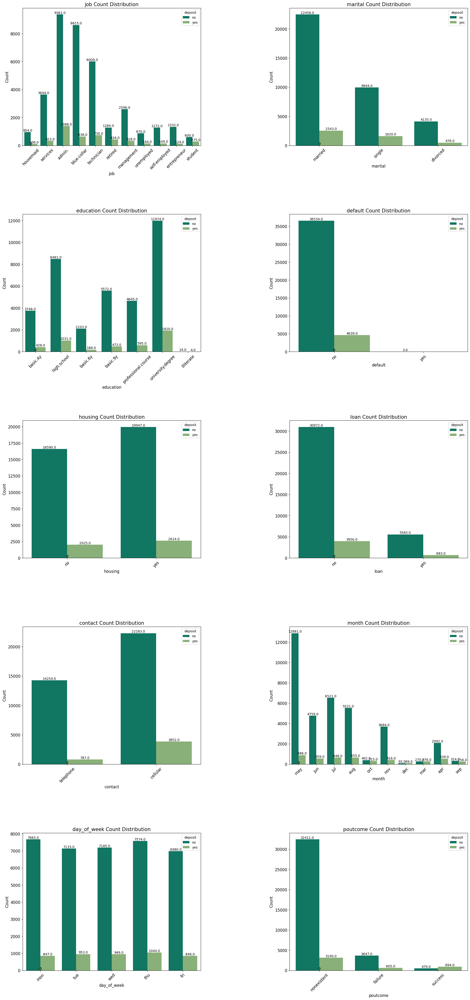

# MLBANKMARKETING

This project of purpose is using bank marketing datasets and build machine learning models and than calculate evaluation metrics and dessicion which model functional.

- [Data Source](http://archive.ics.uci.edu/dataset/222/bank+marketing)

- Look to understand datasets :
    - [First information](https://github.com/GALACICEK/MLBankMarketing/blob/main/datas/bank-additional-names.txt)
    - [Secondary information](https://github.com/GALACICEK/MLBankMarketing/blob/main/datas/bank-names.txt)

- [More Knowlege](https://www.investopedia.com/terms/t/termdeposit.asp)

 ### Requirements :

Generate virtual env on your project. Also you could need that libs, check your libs.

    - pip install pandas
    - pip install numpy
    - pip install matplotlib
    - pip install scikit-learn
    - pip install xgboost
    - pip install statsmodels

Also can write just this code on your terminal:

    - pip install -r requirements.txt

---

### MLBANKMARKETING Project Files
 - [main.ipynb](https://github.com/GALACICEK/MLBankMarketing/blob/main/main.ipynb)
 - [data_collection_and_cleaning.py](https://github.com/GALACICEK/MLBankMarketing/blob/main/data_collection_and_cleaning.py)
 - [exploratory_data_analysis.py](https://github.com/GALACICEK/MLBankMarketing/blob/main/exploratory_data_analysis.py)
 - [machine_learning_models.py](https://github.com/GALACICEK/MLBankMarketing/blob/main/machine_learning_models.py)
 - [datasets](https://github.com/GALACICEK/MLBankMarketing/tree/main/datas)

### Models

- Using Classification Models:
    - Decision Tree
    - Random Forests
    - KNN
    - SVM
    - Logistic Regression
    - GradientBoostingClassifier
    - XGBClassifier
    - GaussianNB 

## Summary

### Collection and Cleaning
- Info DataSets :
    ---
         <class 'pandas.core.frame.DataFrame'>
         RangeIndex: 41188 entries, 0 to 41187
          Data columns (total 21 columns):

        |    |Column          |Non-Null Count  |Dtype   |
        |----| ---            | ---            | ---    |
        | 0  | age            | 41188 non-null | int64  |
        | 1  | job            | 41188 non-null | object |
        | 2  | marital        | 41188 non-null | object |
        | 3  | education      | 41188 non-null | object |
        | 4  | default        | 41188 non-null | object |
        | 5  | housing        | 41188 non-null | object |
        | 6  | loan           | 41188 non-null | object |
        | 7  | contact        | 41188 non-null | object |
        | 8  | month          | 41188 non-null | object |
        | 9  | day_of_week    | 41188 non-null | object |
        | 10 | duration       | 41188 non-null | int64  |
        | 11 | campaign       | 41188 non-null | int64  |
        | 12 | pdays          | 41188 non-null | int64  |
        | 13 | previous       | 41188 non-null | int64  |
        | 14 | poutcome       | 41188 non-null | object |
        | 15 | emp.var.rate   | 41188 non-null | float64|
        | 16 | cons.price.idx | 41188 non-null | float64|
        | 17 | cons.conf.idx  | 41188 non-null | float64|
        | 18 | euribor3m      | 41188 non-null | float64|
        | 19 | nr.employed    | 41188 non-null | float64|
        | 20 | deposit        | 41188 non-null | object |

        dtypes: float64(5), int64(5), object(11)
        memory usage: 6.6+ MB

- Deleted Duplicates: 12
- Clean Data for unknown label
### EDA , Exploratory Data Analysis

- ['job', 'maritial', 'education' , 'default', 'housing', 'hoan', 'contact', 'month', 'day_of_week', 'poutcome']  Categorical Features

- Describe of Categorigs

|	      -     |count	|unique	|top	            |freq
|---            |---	|---	|---	            |---
|job	        |41176	|11	    |admin.	            |10749
|marital	    |41176	|3	    |married	        |25001
|education	    |41176	|7	    |university.degree	|13894
|default	    |41176	|2	    |no	                |41173
|housing	    |41176	|2	    |yes	            |22561
|loan	        |41176	|2	    |no	                |34928
|contact	    |41176	|2	    |cellular	        |26135
|month	        |41176	|10	    |may	            |13767
|day_of_week	|41176	|5	    |thu	            |8618
|poutcome	    |41176	|3	    |nonexistent	    |35551

- ['age','duration','campaign','pdays','previous','emp.var.rate','cons.price.idx','cons.conf.idx','euribor3m','nr.employed'] Numeric Features

-Describe of Numerics
|	        |count	        |mean	        |std	        |min	    | 25%	    |50%	    |75%	    |max |
|	---     |---	        |---	        |---	        |---	    | ---	    |---	    |---	    |--- |
|age	    |41176.0	    |40.023800	    |10.420680	    |17.000	    |32.000	    |38.000	    |47.000	    |98.000 |
|duration	|41176.0	    |258.315815	    |259.305321	    |0.000	    |102.000	|180.000	|319.000	|4918.000 |
|campaign	|41176.0	    |2.567879	    |2.770318	    |1.000	    |1.000	    |2.000	    |3.000	    |56.000 |
|pdays	    |41176.0	    |962.464810	    |186.937102	    |0.000	    |999.000	|999.000	|999.000	|999.000 |
|previous	|41176.0	    |0.173013	    |0.494964	    |0.000	    |0.000	    |0.000	    |0.000	    |7.000 |
|emp.var.rate	|41176.0	|0.081922	    |1.570883	    |-3.400	    |-1.800	    |1.100	    |1.400	    |1.400 |
|cons.price.idx	|41176.0	|93.575720	    |0.578839	    |92.201	    |93.075	    |93.749	    |93.994	    |94.767 |
|cons.conf.idx	|41176.0	|-40.502863	    |4.627860	    |-50.800	|-42.700	|-41.800	|-36.400	|-26.900 |
|euribor3m	    |41176.0	|3.621293	    |1.734437	    |0.634	    |1.344	    |4.857	    |4.961	    |5.045 |
|nr.employed	    |41176.0	|5167.034870	|72.251364	    |4963.600	|5099.100	|5191.000	|5228.100	|5228.100 |

### Model
- LabelEncoding

#### First Report
- Using train,test columns for independent values : 
    - ['age', 'job', 'marital', 'education','housing', 'loan', 'month', 'day_of_week', 'duration',
              'campaign', 'poutcome','emp.var.rate', 'cons.price.idx','cons.conf.idx']
      
- Reports:

    - DT_Bagging 
    accuracy value :  0.909  precision :  0.619  recall:  0.523  f1_score :  0.567 
    -----
    - Random_Forest 
    accuracy value :  0.910  precision :  0.638  recall:  0.493  f1_score :  0.556 
    -----
    - KNeighbors 
    accuracy value :  0.904  precision :  0.668  recall:  0.304  f1_score :  0.418 
    -----
    - SVC-rbf 
    accuracy value :  0.909  precision :  0.674  recall:  0.388  f1_score :  0.493 
    -----
    - SVC-sigmoid 
    accuracy value :  0.861  precision :  0.388  recall:  0.383  f1_score :  0.386 
    -----
    - Logistic_Regression 
    accuracy value :  0.906  precision :  0.648  recall:  0.378  f1_score :  0.477 
    -----
    - Gradient_Boosting 
    accuracy value :  0.913  precision :  0.658  recall:  0.486  f1_score :  0.559 
    -----
    - XGBC 
    accuracy value :  0.910  precision :  0.626  recall:  0.527  f1_score :  0.572 
    -----
    - GaussianNB 
    accuracy value :  0.869  precision :  0.444  recall:  0.586  f1_score :  0.505 
    -----

- It should not be selected based on GaussianNB and SVC-sigmoid auc values. Other models available.
- XGBC, Gradient_Boosting, Random_Forest and DT_Bagging models can be used by looking at f1 scores.
- Since the split operation is random, different results are obtained each time.

#### Second Report

- Using train,test columns for independent values : 
    ['age', 'job', 'marital','education','housing', 'contact' ,'loan',
              'campaign', 'previous','poutcome','emp.var.rate', 'cons.price.idx','cons.conf.idx','euribor3m']

- Reports:

    
    - DT_Bagging 
    accuracy value :  0.889  precision :  0.522  recall:  0.295  f1_score :  0.377 
    -----
    - Random_Forest 
    accuracy value :  0.894  precision :  0.565  recall:  0.288  f1_score :  0.381 
    -----
    - KNeighbors 
    accuracy value :  0.890  precision :  0.538  recall:  0.241  f1_score :  0.333 
    -----
    - SVC-rbf 
    accuracy value :  0.899  precision :  0.685  recall:  0.207  f1_score :  0.318 
    -----
    - SVC-sigmoid 
    accuracy value :  0.837  precision :  0.272  recall:  0.259  f1_score :  0.265 
    -----
    - Logistic_Regression 
    accuracy value :  0.897  precision :  0.650  recall:  0.197  f1_score :  0.303 
    -----
    - Gradient_Boosting 
    accuracy value :  0.899  precision :  0.666  recall:  0.229  f1_score :  0.341 
    -----
    - XGBC 
    accuracy value :  0.894  precision :  0.569  recall:  0.275  f1_score :  0.371 
    -----
    - GaussianNB 
    accuracy value :  0.814  precision :  0.310  recall:  0.520  f1_score :  0.389 
    -----

- The results turned out to be poor compared to the independent variables chosen to the previous value. 
- If desired, a gradient boosting model can be chosen in this case.

